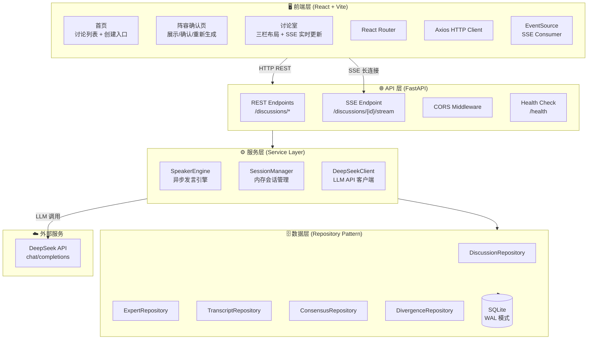
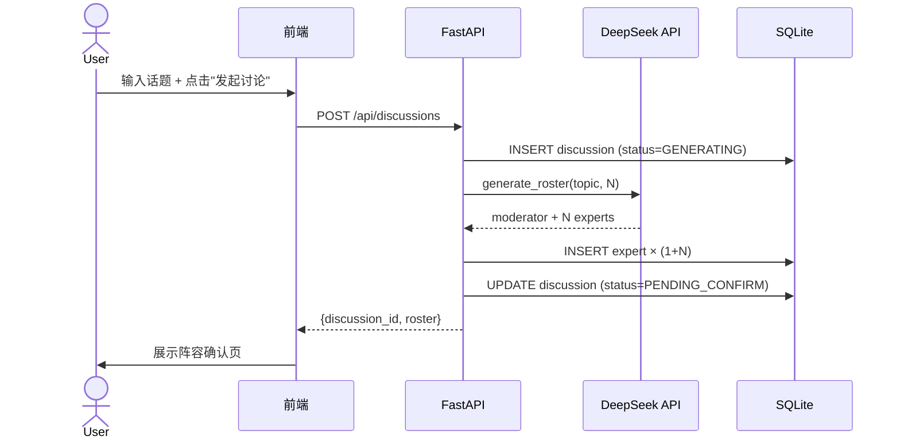
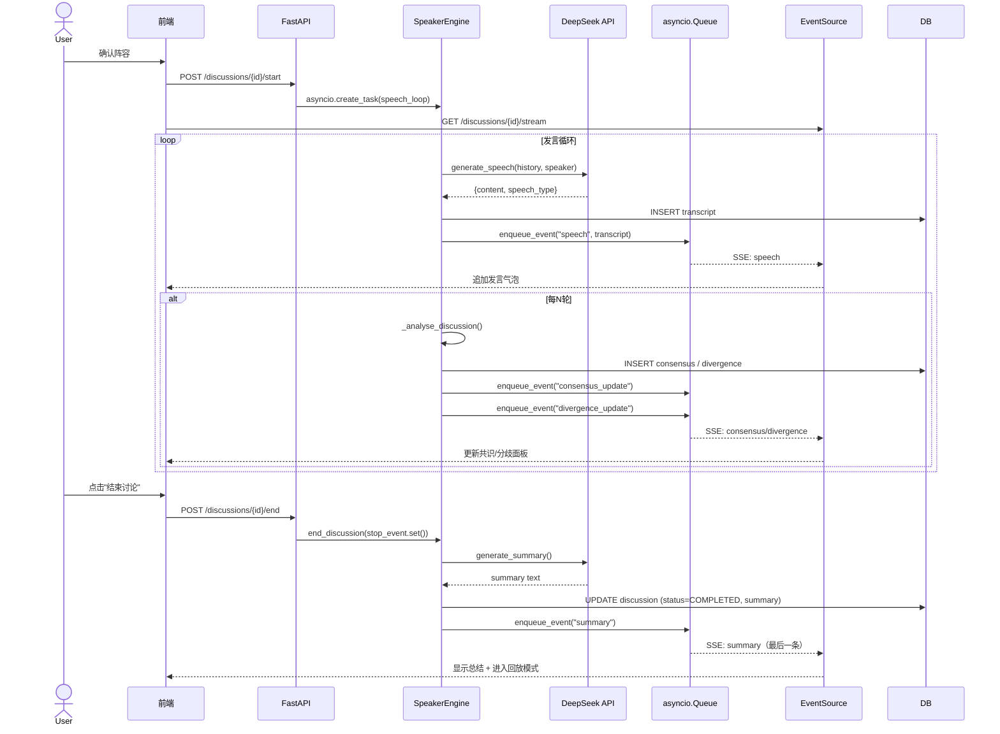
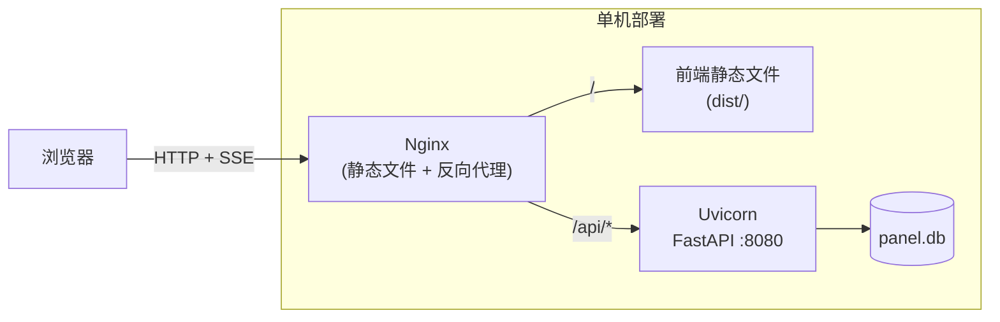

# 系统架构文档

> 版本 1.0 · 圆桌讨论系统 (AI Panel Studio)

---

## 一、系统架构总览



---

## 二、分层说明

### 2.1 前端层（React + Vite）

| 组件 | 技术 | 职责 |
|------|------|------|
| **路由** | React Router DOM v7 | 3 个页面：`/`（首页）、`/discussion/:id`（确认页）、`/room/:id`（讨论室） |
| **HTTP 客户端** | Axios（`api/client.js`） | 统一 baseURL、超时（60s）、请求/响应拦截器（日志 + 错误处理） |
| **SSE 客户端** | 浏览器原生 `EventSource`（`hooks/useSSE.js`） | 连接 SSE 流，解析 JSON 事件，调用回调分发到 Reducer |
| **状态管理** | React `useState` + `useReducer` + `useCallback` | 无第三方状态库——讨论室使用 `useReducer` 管理复杂状态机 |
| **样式** | Tailwind CSS v4 | 全站使用 utility-first CSS，暗色讨论室主题（`bg-gray-900`） |

**关键设计决策：**
- **无全局状态管理库**：应用规模适中，React 内置 Hook 足够。讨论室的状态机用 `useReducer` 实现，其他页面用 `useState` + `useCallback`。
- **三栏布局 + 移动端 Tab 切换**：桌面端三栏同时可见（专家列表 | 发言流 | 共识/分歧），移动端通过底部 Tab 切换。

### 2.2 API 层（FastAPI）

| 组件 | 说明 |
|------|------|
| **`main.py`** | FastAPI 应用入口，挂载 CORS 中间件和路由，lifespan 中初始化数据库 |
| **`routers/discussion.py`** | 所有 `/api/discussions` 端点的实现（创建、列表、详情、启动、结束、重新生成、提问、SSE 流） |
| **CORS** | 开发阶段 `allow_origins=["*"]`，生产需限制 |

**关键设计决策：**
- **模块级单例**：`_disc_repo`、`_expert_repo`、`_llm_client`、`_speaker_engine` 作为模块级变量初始化（无状态 Repository，天然线程安全）
- **SSE 通过 `StreamingResponse` 实现**：异步生成器从 `asyncio.Queue` 读取事件，支持 keep-alive 和优雅关闭
- **事务回滚**：`create_discussion` 在保存专家和更新状态时，通过 try/except + `delete_by_discussion` + `delete` 实现手动回滚

### 2.3 服务层（Service Layer）

#### SpeakerEngine (发言引擎)

核心组件，`asyncio.create_task` 启动的后台协程，驱动讨论生命周期：

```
[开场] → [专家发言 N 轮] → [分析共识/分歧] → [主持人串场] → 循环
   │
   └── stop_event 触发 → [生成主持总结] → [SSE summary 事件]
```

| 参数 | 默认值 | 说明 |
|------|--------|------|
| `ANALYSIS_INTERVAL` | 3 | 每 3 条发言执行一次共识/分歧分析 |
| `MODERATOR_INTERVAL` | 3 | 每 3 条专家发言后主持人串场 |
| `SPEECH_MIN_DELAY` | 2.0s | 发言间隔下限 |
| `SPEECH_MAX_DELAY` | 5.0s | 发言间隔上限 |

#### SessionManager (会话管理)

| 职责 | 说明 |
|------|------|
| **创建会话** | `create_session(discussion_id, experts)` — 讨论开始时调用 |
| **事件入队** | `enqueue_event(discussion_id, event_type, data)` — 包装 JSON 信封并推入 `asyncio.Queue` |
| **停止信号** | `stop_session(discussion_id)` — 设置 `stop_event`，通知发言循环退出 |
| **会话清理** | `remove_session(discussion_id)` — 讨论结束后从内存中移除 |

#### DeepSeekClient (LLM 客户端)

| 方法 | 用途 | 返回 |
|------|------|------|
| `generate_roster(topic, expert_count)` | 生成 1 主持人 + N 专家阵容 | `{moderator, experts[]}` |
| `generate_speech(history, speaker, topic)` | 生成专家发言 | `{content, speech_type}` |
| `generate_summary(...)` | 生成主持总结 | `{summary}` |
| `generate_answer(question, expert)` | 专家回答用户提问 | `string` |

支持两种模式：`USE_MOCK_LLM=true` 使用模拟数据，`false` 则调用 DeepSeek API。

### 2.4 数据层（Repository Pattern）

| 层级 | 说明 |
|------|------|
| **`BaseRepository`** | 通用 CRUD：`get_by_id()`、`list_all()`、`delete()`，提供 `_connection_factory` 上下文管理器 |
| **`DiscussionRepository`** | 讨论表专用：`create()`、`update_status()`、`list_by_status()`、`get_detail()`（JOIN 查询） |
| **`ExpertRepository`** | 专家表专用：`create()`、`delete_by_discussion()`、`get_moderator()` |
| **`TranscriptRepository`** | 发言表专用 + `list_by_discussion()` |
| **`ConsensusRepository`** | 共识表专用 + `get_by_discussion()` |
| **`DivergenceRepository`** | 分歧表专用 + `get_by_discussion()` |

**关键设计决策：**
- **Repository 无状态 + 无 ORM**：每个方法独立打开 SQLite 连接（通过 `_connection_factory`），用完即释放。不使用 SQLAlchemy ORM，直接写原生 SQL——适合小型应用，减少抽象层。
- **没有连接池**：SQLite 的单写锁模式不适合高并发连接池。WAL 模式（Write-Ahead Logging）缓解读写冲突。
- **JSON 字段存储关联**：Consensus/Diverge 的 `source_transcript_ids` 和 `sides` 使用 JSON 文本字段而非关系表——简化查询，牺牲引用完整性。

### 2.5 数据流

#### 创建讨论流程



#### 实时讨论数据流



---

## 三、核心技术决策及理由

| 决策 | 选项 | 选择 | 理由 |
|------|------|------|------|
| **数据库** | SQLite vs PostgreSQL | ✅ SQLite | 零配置、零运维，适合单机部署和小型应用。WAL 模式提供足够的并发性能。 |
| **ORM** | SQLAlchemy vs 原生 SQL | ✅ 原生 SQL + Repository Pattern | Repository Pattern 已提供足够的抽象。原生 SQL 更透明，SQLite 无需复杂的 ORM 映射。 |
| **实时通信** | WebSocket vs SSE | ✅ SSE | 讨论场景的数据流是单向的（服务端 → 客户端），SSE 更简单：原生浏览器支持、自动重连、HTTP/2 兼容。 |
| **前端状态管理** | Redux/Zustand vs React Hooks | ✅ React Hooks (useReducer) | 应用状态不复杂，3 个页面 + 1 个 SSE 流。`useReducer` + `useCallback` 足够，避免引入额外依赖。 |
| **异步任务** | Celery/Redis vs asyncio.create_task | ✅ asyncio.create_task | 发言引擎是纯 I/O 密集型（LLM API 调用 + DB 写入），asyncio 足够。引入消息队列会增加运维复杂度。 |
| **LLM Mock** | 硬编码 vs 环境变量控制 | ✅ `USE_MOCK_LLM` 环境变量 | 开发/测试时无需消耗 API 额度，一键切换。Mock 模式返回中文模拟数据，接近真实效果。 |
| **CSS** | 组件库 vs Tailwind | ✅ Tailwind CSS | 讨论室 UI 高度定制（三栏布局、颜色系统贯穿），组件库反而需要大量覆盖样式。Tailwind 的 utility-first 模式更适合。 |
| **连接管理** | 连接池 vs 每次打开 | ✅ 每次独立打开（Repository Pattern） | SQLite 在低并发下，独立连接更简单安全。WAL 模式处理读写并发。 |

---

## 四、部署架构（推荐）



**Nginx 配置要点：**
- 静态文件：`root /path/to/frontend/dist`
- API 代理：`proxy_pass http://127.0.0.1:8080`
- SSE 代理：`proxy_buffering off`（关键！否则 SSE 事件会被缓冲延迟）
- 超时：`proxy_read_timeout 3600s`（SSE 长连接需要）

---

## 五、项目文件清单

```
圆桌讨论/
├── backend/
│   ├── app/
│   │   ├── main.py                   # FastAPI 入口 + CORS + lifespan
│   │   ├── config.py                 # Pydantic Settings 配置
│   │   ├── database.py               # SQLite 连接管理 + init_db
│   │   ├── exceptions.py             # DuplicateRecordError, ForeignKeyError 等
│   │   ├── llm/
│   │   │   └── client.py             # DeepSeekClient（含 Mock 实现）
│   │   ├── repositories/
│   │   │   ├── base.py               # BaseRepository（通用 CRUD）
│   │   │   ├── discussion_repository.py
│   │   │   ├── expert_repository.py
│   │   │   ├── transcript_repository.py
│   │   │   ├── consensus_repository.py
│   │   │   └── divergence_repository.py
│   │   ├── routers/
│   │   │   └── discussion.py         # 8 个 REST 端点 + 1 个 SSE 端点
│   │   ├── schemas/                  # Pydantic 模型定义（未激活但保留）
│   │   └── services/
│   │       ├── session_manager.py    # 内存会话管理（asyncio.Queue）
│   │       └── speaker_engine.py     # 异步发言引擎
│   ├── tests/                        # pytest 测试套件
│   ├── run.py                        # uvicorn 启动
│   └── requirements.txt
├── frontend/
│   ├── src/
│   │   ├── api/client.js             # Axios 配置 + 所有 API 函数
│   │   ├── hooks/
│   │   │   ├── useDiscussions.js     # 讨论列表数据 Hook
│   │   │   └── useSSE.js             # SSE 连接 Hook
│   │   ├── pages/
│   │   │   ├── Home.jsx              # 首页（列表 + 创建）
│   │   │   ├── Discussion.jsx        # 阵容确认页
│   │   │   └── DiscussionRoom.jsx    # 讨论室（三栏 + 状态机）
│   │   ├── components/
│   │   │   ├── DiscussionCard.jsx
│   │   │   ├── DiscussionList.jsx
│   │   │   └── CreateDiscussionModal.jsx
│   │   └── main.jsx
│   ├── package.json
│   └── vite.config.js
├── docs/
│   ├── PRD.md                        # 产品需求文档
│   ├── ER.md                         # ER 图文档
│   ├── API.md                        # API 文档
│   └── ARCHITECTURE.md               # 本文件
├── schema.sql                        # SQLite DDL（含触发器和索引）
├── er.mermaid                        # ER 图源文件（Mermaid 格式）
├── api-spec.yaml                     # OpenAPI 3.0 规范（完整接口定义）
├── information_architecture.md       # 前端信息架构 + 状态机文档
└── README.md                         # 项目说明
```
