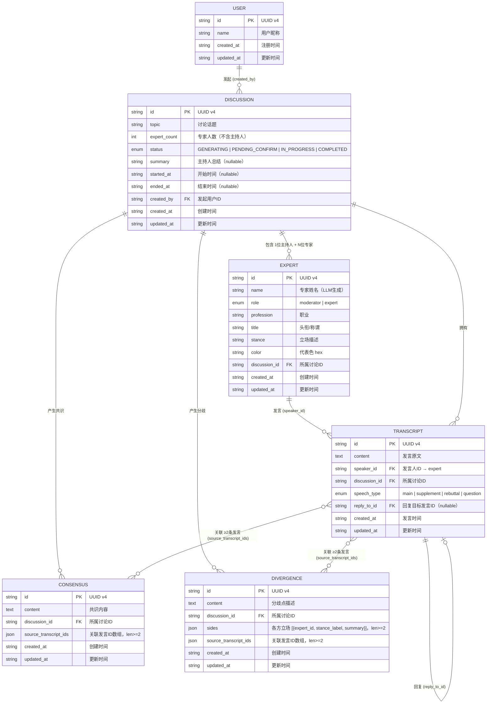

# ER 图文档

> 版本 1.0 · 圆桌讨论系统数据库设计

---

## 一、实体关系图 (ER Diagram)



---

## 二、实体说明

### 2.1 USER（用户）

讨论的发起者。当前版本未实现完整的用户认证系统，使用硬编码的默认用户 ID。

| 字段 | 类型 | 说明 |
|------|------|------|
| `id` | TEXT (UUID) | 主键 |
| `name` | TEXT | 用户昵称 |
| `created_at` | TEXT | 注册时间 |
| `updated_at` | TEXT | 更新时间（触发器自动维护） |

### 2.2 DISCUSSION（讨论）

核心实体，代表一场完整的圆桌讨论。拥有完整的生命周期状态机。

| 字段 | 类型 | 说明 |
|------|------|------|
| `id` | TEXT (UUID) | 主键 |
| `topic` | TEXT | 讨论话题，如"人工智能是否应该拥有法律主体资格？" |
| `expert_count` | INTEGER | 专家人数（不含主持人） |
| `status` | TEXT | 生命周期状态（见下方状态机） |
| `summary` | TEXT | 主持人总结（COMPLETED 后填充，可为空） |
| `started_at` | TEXT | 讨论开始时间（IN_PROGRESS 后填充） |
| `ended_at` | TEXT | 讨论结束时间（COMPLETED 后填充） |
| `created_by` | TEXT (FK) | 发起用户 ID → `user.id` |
| `created_at` | TEXT | 创建时间 |
| `updated_at` | TEXT | 更新时间（触发器自动维护） |

**状态机：**

```
GENERATING ──(LLM生成成功)──▶ PENDING_CONFIRM ──(用户确认)──▶ IN_PROGRESS ──(用户结束)──▶ COMPLETED
     │                              │
     └──(生成失败)──▶ 回滚删除        └──(用户拒绝)──▶ 删除讨论
```

| 状态 | 含义 | 可触发的操作 |
|------|------|-------------|
| `GENERATING` | LLM 正在生成阵容 | —（中间状态，不可操作） |
| `PENDING_CONFIRM` | 阵容已生成，等待用户确认 | 重新生成、确认并开始 |
| `IN_PROGRESS` | 讨论进行中 | 结束讨论、向专家提问 |
| `COMPLETED` | 讨论已结束，总结已生成 | 查看回放 |

### 2.3 EXPERT（专家）

代表一场讨论中的一位参与者，由 LLM 自动生成。每场讨论有且仅有一位主持人（role=moderator）。

| 字段 | 类型 | 说明 |
|------|------|------|
| `id` | TEXT (UUID) | 主键 |
| `name` | TEXT | 专家姓名（中文，LLM 生成） |
| `role` | TEXT | `moderator`（主持人）或 `expert`（专家） |
| `profession` | TEXT | 职业，如"法学教授" |
| `title` | TEXT | 头衔，如"北京大学法学院教授" |
| `stance` | TEXT | 立场描述，如"支持赋予AI有限法律主体资格" |
| `color` | TEXT | 代表色（hex），如 `#3B82F6`，贯穿前端所有触点 |
| `discussion_id` | TEXT (FK) | 所属讨论 ID → `discussion.id` |

**约束：**
- 每个 discussion 有且仅有一个 moderator（通过 `UNIQUE INDEX idx_expert_moderator_unique ON expert(discussion_id) WHERE role = 'moderator'` 保证）
- 删除 discussion 时级联删除所有关联 expert

### 2.4 TRANSCRIPT（发言记录）

记录讨论中的每一条发言，由 speaker_engine 生成并持久化。

| 字段 | 类型 | 说明 |
|------|------|------|
| `id` | TEXT (UUID) | 主键 |
| `content` | TEXT | 发言原文（不可为空） |
| `speaker_id` | TEXT (FK) | 发言人 ID → `expert.id` |
| `discussion_id` | TEXT (FK) | 所属讨论 ID |
| `speech_type` | TEXT | `main`（主发言）/ `supplement`（补充）/ `rebuttal`（反驳）/ `question`（提问） |
| `reply_to_id` | TEXT (FK) | 回复目标发言 ID → `transcript.id`（supplement/rebuttal 时必填） |
| `created_at` | TEXT | 发言时间 |
| `updated_at` | TEXT | 更新时间 |

**约束：**
- `speech_type` 为 `supplement` 或 `rebuttal` 时，`reply_to_id` 不可为空
- 讨论状态为 `COMPLETED` 后，触发器阻止新增发言

### 2.5 CONSENSUS（共识）

讨论过程中，speaker_engine 每 N 轮分析后识别出的共识点。

| 字段 | 类型 | 说明 |
|------|------|------|
| `id` | TEXT (UUID) | 主键 |
| `content` | TEXT | 共识内容（不可为空） |
| `discussion_id` | TEXT (FK) | 所属讨论 ID |
| `source_transcript_ids` | TEXT (JSON) | 关联的发言 ID 数组（>=2 条） |
| `created_at` | TEXT | 创建时间 |
| `updated_at` | TEXT | 更新时间 |

### 2.6 DIVERGENCE（分歧）

讨论过程中识别出的分歧点。使用 JSON 数组存储各方立场摘要（`sides`）。

| 字段 | 类型 | 说明 |
|------|------|------|
| `id` | TEXT (UUID) | 主键 |
| `content` | TEXT | 分歧点描述（不可为空） |
| `discussion_id` | TEXT (FK) | 所属讨论 ID |
| `sides` | TEXT (JSON) | 各方立场，格式：`[{expert_id, stance_label, summary}]`，>=2 条 |
| `source_transcript_ids` | TEXT (JSON) | 关联的发言 ID 数组（>=2 条） |
| `created_at` | TEXT | 创建时间 |
| `updated_at` | TEXT | 更新时间 |

---

## 三、实体间关系

| 关系 | 类型 | 说明 |
|------|------|------|
| USER → DISCUSSION | **一对多** | 一个用户可以发起多场讨论 |
| DISCUSSION → EXPERT | **一对多** | 一场讨论包含 1 位主持人 + N 位专家；级联删除 |
| EXPERT → TRANSCRIPT | **一对多** | 一位专家在讨论中可以有多条发言；级联删除 |
| DISCUSSION → TRANSCRIPT | **一对多** | 一场讨论包含多条发言；级联删除 |
| TRANSCRIPT → TRANSCRIPT | **自引用** | `reply_to_id` 指向被回复的发言；删除时 SET NULL |
| DISCUSSION → CONSENSUS | **一对多** | 一场讨论可以产生多条共识；级联删除 |
| DISCUSSION → DIVERGENCE | **一对多** | 一场讨论可以产生多条分歧；级联删除 |
| TRANSCRIPT ↔ CONSENSUS | **多对多** | 通过 JSON 数组 `source_transcript_ids` 关联 |
| TRANSCRIPT ↔ DIVERGENCE | **多对多** | 通过 JSON 数组 `source_transcript_ids` 关联 |

> **注意**：CONSENSUS 和 DIVERGENCE 与 TRANSCRIPT 的关联通过 JSON 数组字段实现（而非关系表），这是为了简化设计并利用 SQLite 的 JSON1 扩展。代价是无法在数据库层面强制执行引用完整性——`source_transcript_ids` 中的 ID 可能指向已删除的发言。
