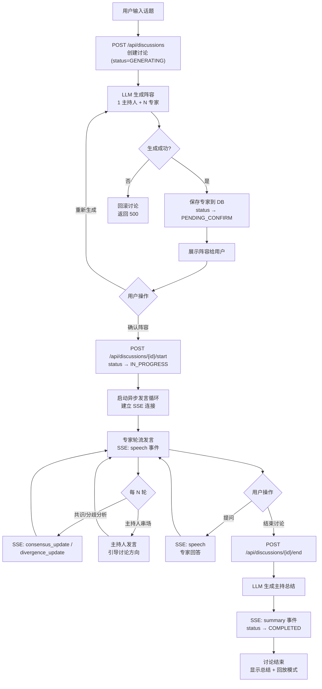

# 产品需求文档 (PRD)

> 版本 1.0 · 圆桌讨论系统 (AI Panel Studio)

---

## 一、产品定位与核心价值主张

**产品定位**：一个基于大语言模型（LLM）的 AI 原生协作讨论平台。用户只需输入一个话题，系统自动生成持多元立场的专家团队，进行实时、自主的圆桌辩论，并在讨论过程中识别共识与分歧。

**核心价值主张**：

> "让每一个复杂议题，都能听到多元且高质量的观点碰撞。"

- **替代信息茧房**：AI 生成的专家持有截然不同的立场，强制用户面对反对意见
- **提升思考深度**：不是给出单一答案，而是展示论点的多维光谱
- **降低组织成本**：无需邀请真人专家，即刻获得一场高信息密度的讨论

---

## 二、目标用户画像

| 画像 | 场景 | 核心需求 |
|------|------|----------|
| **研究者 / 学生** | 撰写论文前梳理正反观点 | 获取多立场论据，发现论证盲点 |
| **产品经理 / 决策者** | 重大决策前的利弊分析 | 模拟多方利益相关者的视角，预判反对意见 |
| **媒体从业者 / 内容创作者** | 撰写深度报道前的背景调研 | 快速了解一个复杂议题的主要分歧点 |
| **普通知识爱好者** | 对公共议题感兴趣，想听到多元声音 | 低门槛获取高质量的多元讨论，不被算法推荐的信息茧房所困 |

---

## 三、用户痛点分析

| 痛点 | 现有解决方案的局限 | 本产品如何解决 |
|------|-------------------|---------------|
| **信息茧房** | 社交媒体算法只推送与自己观点相符的内容 | AI 专家预设相反立场，用户无法"跳过"反对意见 |
| **专家获取成本高** | 邀请真人专家需要协调时间、费用高昂 | AI 模拟专家，0 边际成本生成多元阵容 |
| **讨论质量不稳定** | 论坛/评论区质量参差不齐，缺乏结构 | 结构化的圆桌流程：开场→辩论→共识/分歧识别→总结 |
| **单一视角的决策风险** | 团队会议容易出现群体思维 (groupthink) | 系统强制引入反对者角色，模拟魔鬼代言人 |
| **讨论记录难以沉淀** | 口头讨论转瞬即逝，缺乏结构化输出 | 完整的 Transcript + 共识/分歧清单 + 主持人总结 |

---

## 四、功能需求列表

### 4.1 P0 — 核心流程（必须实现）

| ID | 功能 | 描述 | 优先级 |
|----|------|------|--------|
| F1 | 创建讨论 | 用户输入话题 + 选择专家人数（1-8），调用 LLM 生成阵容 | P0 |
| F2 | 阵容管理 | 展示 AI 生成的阵容，用户可"重新生成"或"确认" | P0 |
| F3 | 异步发言引擎 | 确认后自动启动专家发言循环，按 round-robin 轮流发言 | P0 |
| F4 | 实时推送 (SSE) | 发言、状态变更、共识/分歧更新通过 SSE 实时推送到前端 | P0 |
| F5 | 主持人串场 | 每 N 轮发言后，主持人自动总结并引导讨论方向 | P0 |
| F6 | 主持总结 | 用户手动结束讨论时，生成自然语言总结 | P0 |
| F7 | 讨论列表 | 首页展示所有讨论，按状态筛选（进行中/已结束） | P0 |
| F8 | 讨论详情 | 查看完整 Transcript + 共识 + 分歧 + 总结 | P0 |

### 4.2 P1 — 增强体验

| ID | 功能 | 描述 | 优先级 |
|----|------|------|--------|
| F9 | 用户提问 | 在讨论进行中向指定专家提问 | P1 |
| F10 | 阵容微调 | 用户可在确认前手动编辑专家属性（姓名、立场等） | P1 |
| F11 | 共识/分歧识别 | 每 N 轮自动分析对话，识别共识点和分歧点 | P1 |
| F12 | 移动端适配 | 讨论室三栏布局在移动端切换为 Tab 模式 | P1 |

### 4.3 P2 — 未来迭代

| ID | 功能 | 描述 |
|----|------|------|
| F13 | 用户系统 | 注册/登录/JWT 鉴权 |
| F14 | 讨论回放 | 结束后的讨论以时间轴形式回放 |
| F15 | 讨论导出 | 将讨论内容导出为 PDF / Markdown |
| F16 | 自定义专家 | 用户手动指定某些专家的角色和立场 |
| F17 | 多语言 | 支持英文和其他语言的讨论 |

---

## 五、非功能需求

| 类别 | 需求 | 指标 |
|------|------|------|
| **性能** | LLM 阵容生成响应时间 | < 30s（P95） |
| **性能** | SSE 事件延迟 | < 2s（从服务端生成到前端渲染） |
| **性能** | 专家发言生成间隔 | 2-5s（可配置） |
| **可用性** | 无 API Key 时的 Mock 模式 | 可完整运行核心流程，使用模拟数据 |
| **可靠性** | SSE 连接断开自动重连 | 指数退避（1s→2s→4s→8s→max 30s） |
| **数据完整性** | 创建讨论失败时回滚 | 删除已创建但未完成的数据，不残留 GENERATING 状态 |
| **兼容性** | 浏览器支持 | Chrome/Firefox/Safari/Edge 近 2 个大版本 |
| **安全性** | CORS | 开发阶段 allow_origins=["*"]，生产需限制 |

---

## 六、核心流程图



---

## 七、页面信息架构

```
圆桌讨论 App
├── /                         → 首页（讨论列表 + 创建入口）
├── /discussion/:id           → 阵容确认页
└── /room/:id                 → 讨论室（三栏布局 + SSE）
```

| 路由 | 页面 | 核心数据源 |
|------|------|-----------|
| `/` | 首页 | `GET /api/discussions` |
| `/discussion/:id` | 阵容确认页 | `GET /api/discussions/{id}` |
| `/room/:id` | 讨论室 | `GET /api/discussions/{id}` + SSE `stream` |
