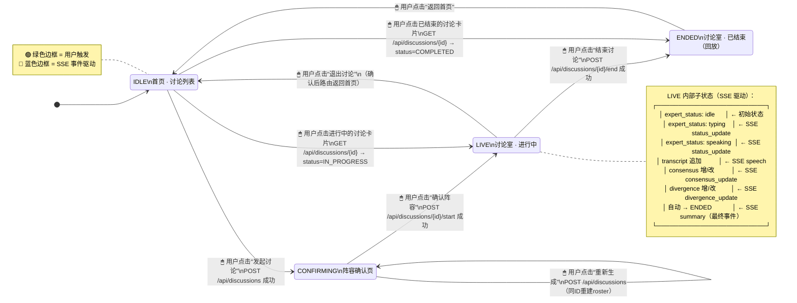

# 圆桌讨论系统 — 页面信息架构 & 前端状态机

> 版本 1.0 · UX 架构定义

---

## 一、页面信息架构（IA）

```
圆桌讨论 App
│
├── /                          →  首页（讨论列表）
│
├── /discussions/:id/confirm   →  阵容确认页
│
└── /discussions/:id/room      →  讨论室页
    │
    └── SSE: /api/discussions/:id/stream
```

---

### 1.1 首页 — `/`

**路由：** `/`

**进入条件：** 前端状态 `IDLE`

**页面区块：**

```
┌─────────────────────────────────────────────────────┐
│  HEADER                                              │
│  [Logo 圆桌讨论]                    [用户头像 · 张明远] │
├─────────────────────────────────────────────────────┤
│                                                       │
│  HERO / CTA                                          │
│  ┌───────────────────────────────────────────────┐  │
│  │  ✨ 发起一场圆桌讨论                             │  │
│  │  输入话题，AI 为你生成多元观点的专家阵容          │  │
│  │                                                 │  │
│  │  [话题输入框................................]   │  │
│  │  专家人数: [▼ 4]    [发起讨论 →]                │  │
│  └───────────────────────────────────────────────┘  │
│                                                       │
│  TAB BAR                                              │
│  [进行中 (3)]  [已结束 (12)]                          │
│                                                       │
│  DISCUSSION CARD LIST                                 │
│  ┌───────────────────────────────────────────────┐  │
│  │ 🔵 进行中                                       │  │
│  │ 人工智能是否应该拥有法律主体资格？                │  │
│  │ 4 位专家 · 12 条发言 · 2 共识 · 1 分歧          │  │
│  │ 创建于 2026-07-16 08:00          [进入讨论 →]  │  │
│  └───────────────────────────────────────────────┘  │
│  ┌───────────────────────────────────────────────┐  │
│  │ ⚪ 已结束                                       │  │
│  │ 太空殖民的伦理边界                               │  │
│  │ 5 位专家 · 28 条发言                             │  │
│  │ 摘要: 本次讨论达成核心共识...         [查看 →]  │  │
│  └───────────────────────────────────────────────┘  │
│                                                       │
└─────────────────────────────────────────────────────┘
```

**区块说明：**

| 区块 | 数据来源 | 交互 |
|---|---|---|
| **Header** | 全局状态（当前用户） | 无 |
| **Hero / CTA** | 本地表单状态 | 输入话题 → 选择人数 → 点击"发起讨论" → `POST /api/discussions` → 路由跳转至阵容确认页 |
| **Tab Bar** | `GET /api/discussions` 按 status 计数 | 切换筛选，更新下方列表 |
| **Discussion Card** | `GET /api/discussions?status=&user_id=` | 点击卡片 → 根据 status 跳转：`IN_PROGRESS` → 讨论室；`COMPLETED` → 讨论室（只读回放模式） |

**卡片信息层级：**
1. 状态指示灯（颜色圆点）
2. 话题（主标题）
3. 元信息行：专家人数 · 发言数 · 共识数 · 分歧数
4. 时间戳
5. 操作按钮

---

### 1.2 阵容确认页 — `/discussions/:id/confirm`

**路由：** `/discussions/:id/confirm`

**进入条件：** `POST /api/discussions` 成功后自动跳转；前端状态 `CONFIRMING`

**页面区块：**

```
┌──────────────────────────────────────────────────────────────────┐
│  HEADER                                                           │
│  [← 返回]  确认专家阵容                                           │
├──────────────────────────────────────────────────────────────────┤
│                                                                    │
│  TOPIC BANNER                                                     │
│  ┌────────────────────────────────────────────────────────────┐  │
│  │  讨论话题：人工智能是否应该拥有法律主体资格？                  │  │
│  │  专家人数：3 人 + 1 位主持人                                 │  │
│  └────────────────────────────────────────────────────────────┘  │
│                                                                    │
│  MODERATOR CARD（突出展示）                                        │
│  ┌────────────────────────────────────────────────────────────┐  │
│  │  ╔══════════════════════════════════════════════════════╗   │  │
│  │  ║  🎤 主持人                                         ║   │  │
│  │  ║  ┌─────────────────────────────────────────────┐    ║   │  │
│  │  ║  │  陈若溪                                      │    ║   │  │
│  │  ║  │  科技媒体主编 · 《前沿对话》栏目首席主持人      │    ║   │  │
│  │  ║  │  立场：中立引导者                              │    ║   │  │
│  │  ║  │  ━━━━━━━━━━  #6B7280                        │    ║   │  │
│  │  ║  └─────────────────────────────────────────────┘    ║   │  │
│  │  ╚══════════════════════════════════════════════════════╝   │  │
│  └────────────────────────────────────────────────────────────┘  │
│                                                                    │
│  EXPERT CARDS（网格排列，每行 N 个）                                │
│  ┌──────────────────────┐ ┌──────────────────────┐ ┌────────────┐│
│  │ ┌──────────────────┐ │ │ ┌──────────────────┐ │ │ ┌────────┐ ││
│  │ │ 林浩然            │ │ │ │ 苏婉清            │ │ │ │ 赵承宇  │ ││
│  │ │ 法学教授           │ │ │ │ 技术伦理学家       │ │ │ │ AI企业家 │ ││
│  │ │ 北京大学法学院教授  │ │ │ │ 牛津大学高级研究员  │ │ │ │ 深脑科技 │ ││
│  │ │                    │ │ │ │                    │ │ │ │ CEO     │ ││
│  │ │ 支持赋予AI         │ │ │ │ 强烈反对赋予AI     │ │ │ │ 实用主义 │ ││
│  │ │ 有限法律主体资格    │ │ │ │ 任何法律地位       │ │ │ │ 行业自律 │ ││
│  │ │                    │ │ │ │                    │ │ │ │ 优于立法 │ ││
│  │ │ ━━ #3B82F6        │ │ │ │ ━━ #EF4444        │ │ │ │━━#10B981│ ││
│  │ └──────────────────┘ │ │ └──────────────────┘ │ │ └────────┘ ││
│  └──────────────────────┘ └──────────────────────┘ └────────────┘│
│                                                                    │
│  ACTION BAR（底部固定）                                             │
│  ┌────────────────────────────────────────────────────────────┐  │
│  │  [🔄 重新生成]              [✓ 确认阵容 · 开始讨论]         │  │
│  └────────────────────────────────────────────────────────────┘  │
│                                                                    │
└──────────────────────────────────────────────────────────────────┘
```

**区块说明：**

| 区块 | 数据来源 | 交互 |
|---|---|---|
| **Topic Banner** | `CreateDiscussionResponse.topic` + `expert_count` | 纯展示 |
| **Moderator Card** | `CreateDiscussionResponse.roster[0]`（role=moderator） | 视觉突出：深色边框、🎤 图标、"主持人"标签 |
| **Expert Cards** | `CreateDiscussionResponse.roster[1..N]`（role=expert） | 每张卡片展示：姓名、职业、Title、立场、颜色色条 |
| **"重新生成"按钮** | — | 用户点击 → `POST /api/discussions`（复用同一 discussion_id，后端重新生成 roster） |
| **"确认阵容"按钮** | — | 用户点击 → `POST /api/discussions/{id}/start` → 路由跳转至讨论室 |

**卡片设计约束：**
- 主持人卡片与专家卡片视觉层级需明显区分（边框色、尺寸、图标）
- 颜色色条 (`color`) 作为卡片的左侧装饰条（4px 宽），与后续 Transcript 发言气泡色一致
- 立场文本 (`stance`) 若超过 60 字则截断 + tooltip

---

### 1.3 讨论室页 — `/discussions/:id/room`

**路由：** `/discussions/:id/room`

**进入条件：** 阵容确认后跳转，或从首页点击进行中的讨论卡片；前端状态 `LIVE` 或 `ENDED`（只读回放）

**页面布局（三栏）：**

```
┌──────────────────────────────────────────────────────────────────────────┐
│  HEADER                                                                   │
│  [← 退出讨论]  人工智能是否应该拥有法律主体资格？    [⏹ 结束讨论]         │
│  状态: ● LIVE · 已进行 42 分钟 · 14 条发言                                 │
├────────────────┬──────────────────────────────────┬───────────────────────┤
│                │                                   │                       │
│  左侧 (280px)  │       中央 (flex-1)               │  右侧 (320px)         │
│  专家列表       │       Transcript 流              │  共识 & 分歧面板       │
│                │                                   │                       │
│ ┌────────────┐ │  ┌─────────────────────────────┐ │  ┌─────────────────┐  │
│ │ 🎤 主持人   │ │  │                             │ │  │ 📋 共识 (2)     │  │
│ │ ● 陈若溪    │ │  │ 💬 陈若溪（主持人）           │ │  │                 │  │
│ │   #6B7280   │ │  │ 欢迎各位来到今天的圆桌讨论…   │ │  │ ┌─────────────┐ │  │
│ │             │ │  │ 08:10                       │ │  │ │ 法律框架存在 │ │  │
│ └────────────┘ │  │                             │ │  │ │ 责任归属灰色 │ │  │
│                │  │ ───────────────────────────── │ │  │ │ 地带        │ │  │
│ ┌────────────┐ │  │                             │ │  │ │ 关联: #2,#4 │ │  │
│ │ 👤 专家1    │ │  │ 💬 林浩然（法学教授）          │ │  │ └─────────────┘ │  │
│ │ ● 林浩然    │ │  │ 我认为应当赋予AI有限的        │ │  │                 │  │
│ │   发言中     │ │  │ 法律主体资格…                │ │  │ ┌─────────────┐ │  │
│ │   #3B82F6   │ │  │ 08:10                       │ │  │ │ ...         │ │  │
│ │             │ │  │                             │ │  │ └─────────────┘ │  │
│ └────────────┘ │  │  ┌──────────────────────┐    │ │  └─────────────────┘  │
│                │  │  │ 🔥 苏婉清 反驳 ↑      │    │ │                       │
│ ┌────────────┐ │  │  │ 林教授，恕我直言…     │    │ │  ┌─────────────────┐  │
│ │ 👤 专家2    │ │  │  │ 08:12               │    │ │  │ ⚡ 分歧 (1)     │  │
│ │ ○ 苏婉清    │ │  │  └──────────────────────┘    │ │  │                 │  │
│ │   待机       │ │  │                             │ │  │ ┌─────────────┐ │  │
│ │   #EF4444   │ │  │ ───────────────────────────── │ │  │ │ 核心分歧:    │ │  │
│ │             │ │  │                             │ │  │ │ AI法律人格   │ │  │
│ └────────────┘ │  │ 💬 赵承宇（AI企业家）补充 ↑    │ │  │ │ vs. 纯人类    │ │  │
│                │  │ 我补充一点实务视角…            │ │  │ │ 责任框架     │ │  │
│ ┌────────────┐ │  │ 08:14                       │ │  │ │              │ │  │
│ │ 👤 专家3    │ │  │                             │ │  │ │ 林浩然: 支持 │ │  │
│ │ ○ 赵承宇    │ │  │                             │ │  │ │ 苏婉清: 反对 │ │  │
│ │   待机       │ │  │         ▼ 自动滚动           │ │  │ │ 赵承宇: 务实 │ │  │
│ │   #10B981   │ │  │                             │ │  │ │ 反对        │ │  │
│ └────────────┘ │  │                             │ │  │ └─────────────┘ │  │
│                │  │                             │ │  └─────────────────┘  │
│                │  │                             │ │                       │
├────────────────┴──────────────────────────────────┴───────────────────────┤
│  STATUS BAR                                                                │
│  ● 林浩然 正在发言中...    |    共识 2 条 · 分歧 1 条    |    14 条发言     │
└──────────────────────────────────────────────────────────────────────────┘
```

**三栏详情：**

#### 左侧栏 — 专家列表 (280px)

| 元素 | 说明 |
|---|---|
| **专家条目** | 按 roster 顺序排列，主持人始终置顶 |
| **状态灯** | `● 绿色` = 正在发言 (speaking)；`◉ 黄色` = 正在组织语言 (typing)；`○ 灰色` = 待机 (idle) |
| **颜色色条** | 头像左侧 4px 竖线，对应 expert.color |
| **角色标签** | 主持人显示 🎤 图标；专家显示 👤 |
| **来源** | 初始来自 `GET /api/discussions/{id}` 的 `experts[]` 字段；状态灯由 SSE `status_update` 事件实时驱动 |

#### 中央栏 — Transcript 流 (flex-1)

| 元素 | 说明 |
|---|---|
| **发言气泡** | 左侧色条颜色 = 发言人 color；气泡宽度自适应内容 |
| **发言人标识** | 姓名 + 角色（主持人/专家） |
| **发言类型视觉区分** | `main` = 标准气泡；`rebuttal` = 红色左边框 + "🔥 反驳 ↑"；`supplement` = 蓝色左边框 + "📎 补充 ↑"；`question` = 黄色左边框 + "❓ 提问" |
| **回复关联** | `reply_to_id` 非空时，气泡上方显示被回复内容的缩略引用（"↑ 回复 @xxx：…"），点击跳转至原发言 |
| **自动滚动** | 新发言到达时自动 scrollToBottom（若用户手动上滚超过 200px 则暂停自动滚动，显示"↓ 新消息"浮动按钮） |
| **来源** | 初始来自 `GET /api/discussions/{id}` 的 `transcripts[]`；增量由 SSE `speech` 事件实时追加 |

#### 右侧栏 — 共识 & 分歧 (320px)

| 面板 | 说明 |
|---|---|
| **共识面板 (📋)** | 每条共识为一张可折叠卡片，展示 `content` + 关联发言数。新增/更新时卡片有短暂高亮动画（黄色闪烁 1s）。数量 badge 实时更新 |
| **分歧面板 (⚡)** | 每条分歧展示 `content` 和各方立场摘要 (`sides[]`)。各方以不同颜色的标签条展示。数量 badge 实时更新 |
| **来源** | 初始来自 `GET /api/discussions/{id}` 的 `consensus_list[]` 和 `divergence_list[]`；增量由 SSE `consensus_update` / `divergence_update` 事件实时更新 |

#### 底部状态栏

| 元素 | 说明 |
|---|---|
| 当前发言者指示 | "● {expert_name} 正在发言中..." — 当 SSE `status_update` 中 `expert_status=speaking` 时更新 |
| 统计快照 | 共识数 · 分歧数 · 总发言数 — 每次 SSE 事件后增量刷新 |

#### Header 操作

| 按钮 | 触发 | 后续 |
|---|---|---|
| **"退出讨论"** | 用户点击 | 若 status = `IN_PROGRESS`：弹出确认框"讨论仍在进行，退出后可通过首页重新进入"；若 status = `COMPLETED`：直接返回首页 |
| **"⏹ 结束讨论"** | 用户点击 | 二次确认 → `POST /api/discussions/{id}/end` → 等待 SSE `summary` 事件 → 前端状态 → `ENDED` |

#### ENDED 回放模式差异

当 `status = COMPLETED` 时进入讨论室：
- 左侧专家列表：所有状态灯变为 `○ 灰色`，不显示 typing/speaking 动画
- 中央 Transcript：完整展示全部发言（无实时增量），可自由滚动
- 右侧面板：展示最终共识/分歧快照
- 底部状态栏替换为：主持人的 `summary` 文本（引用块样式）
- Header 不显示"结束讨论"按钮
- SSE 流不再连接

---

## 二、前端状态机



---

## 三、状态转换详细说明

### 3.1 用户触发转换（🖱）

| 起点 | 终点 | 触发器 | API 调用 | 前端行为 |
|---|---|---|---|---|
| `IDLE` | `CONFIRMING` | 点击"发起讨论" | `POST /api/discussions` | 显示 loading → 成功则路由跳转至 `/discussions/:id/confirm` |
| `CONFIRMING` | `CONFIRMING` | 点击"重新生成" | `POST /api/discussions`（同 id） | roster 卡片 fade-out → loading → 新阵容 fade-in |
| `CONFIRMING` | `LIVE` | 点击"确认阵容" | `POST /api/discussions/{id}/start` | 路由跳转至 `/discussions/:id/room`，建立 SSE 连接 |
| `LIVE` | `ENDED` | 点击"结束讨论" | `POST /api/discussions/{id}/end` | 等待 SSE `summary` → 状态变更为 ENDED → 关闭 SSE |
| `LIVE` | `IDLE` | 点击"退出讨论" | 无 | 确认弹窗 → 路由返回 `/` |
| `ENDED` | `IDLE` | 点击"返回首页" | 无 | 路由返回 `/` |
| `IDLE` | `LIVE` | 点击 IN_PROGRESS 卡片 | `GET /api/discussions/{id}` | 路由跳转至 `/discussions/:id/room`，建立 SSE 连接 |
| `IDLE` | `ENDED` | 点击 COMPLETED 卡片 | `GET /api/discussions/{id}` | 路由跳转至 `/discussions/:id/room`（回放模式，无 SSE） |

### 3.2 SSE 事件驱动转换（📡）

SSE 只在 `LIVE` 状态下连接；进入 `ENDED` 或离开讨论室时断开。

| SSE 事件 | 影响的 UI 区域 | 前端行为 |
|---|---|---|
| `status_update` (expert_status: typing) | 左侧栏 · 专家条目 | 状态灯 → ◉ 黄色脉冲动画；底部状态栏显示"{name} 正在组织语言..." |
| `status_update` (expert_status: speaking) | 左侧栏 · 专家条目 | 状态灯 → ● 绿色常亮；底部状态栏更新当前发言者 |
| `status_update` (expert_status: idle) | 左侧栏 · 专家条目 | 状态灯 → ○ 灰色 |
| `speech` | 中央栏 · Transcript | 追加发言气泡；自动滚动；发言计数 +1 |
| `consensus_update` (action: created) | 右侧栏 · 共识面板 | 追加共识卡片（高亮动画）；共识计数 +1 |
| `consensus_update` (action: updated) | 右侧栏 · 共识面板 | 对应卡片内容替换（高亮动画） |
| `divergence_update` (action: created) | 右侧栏 · 分歧面板 | 追加分歧卡片（高亮动画）；分歧计数 +1 |
| `divergence_update` (action: updated) | 右侧栏 · 分歧面板 | 对应卡片内容替换（高亮动画） |
| `summary` | 全局 → `ENDED` | **状态切换为 ENDED**；关闭 SSE；底部显示总结；Header 隐藏"结束讨论"按钮 |

### 3.3 边界保护

| 场景 | 规则 |
|---|---|
| 用户在 `CONFIRMING` 页刷新浏览器 | 重新 `GET /api/discussions/{id}` → 若 status 仍为 `PENDING_CONFIRM`，恢复确认页；若已变为 `IN_PROGRESS`，自动跳转讨论室 |
| 用户在 `LIVE` 页刷新浏览器 | 重新 `GET /api/discussions/{id}` 获取全量数据（Transcript + 共识 + 分歧快照），重新建立 SSE 连接 |
| SSE 连接意外断开 | 指数退避重连（1s → 2s → 4s → 8s → max 30s），重连期间显示"连接中断，正在重连..."横幅 |
| `summary` 事件到达 | 最终事件，前端无需重连；状态锁定为 `ENDED` |
| 多个 Tab 同时打开同一个讨论 | 每个 Tab 独立建 SSE 连接；无需同步（后端广播） |

---

## 四、组件树（逻辑层级）

```
App
├── Header
│   ├── Logo
│   ├── UserAvatar
│   └── (讨论室模式) ExitButton + EndDiscussionButton
│
├── Routes
│   ├── HomePage
│   │   ├── HeroCTA
│   │   │   ├── TopicInput
│   │   │   ├── ExpertCountSelect
│   │   │   └── CreateButton
│   │   ├── StatusTabBar
│   │   └── DiscussionCardList
│   │       └── DiscussionCard
│   │           ├── StatusIndicator
│   │           ├── MetaInfo (专家数 · 发言数 · 共识 · 分歧)
│   │           └── ActionButton
│   │
│   ├── ConfirmPage
│   │   ├── TopicBanner
│   │   ├── ModeratorCard (突出样式)
│   │   ├── ExpertCardGrid
│   │   │   └── ExpertCard
│   │   │       ├── Avatar + ColorStripe
│   │   │       ├── Name / Profession / Title
│   │   │       └── StanceText
│   │   └── ActionBar
│   │       ├── RegenerateButton
│   │       └── ConfirmButton
│   │
│   └── RoomPage
│       ├── RoomHeader (Title + StatusBadge + ElapsedTimer)
│       ├── LeftPanel · ExpertList
│       │   └── ExpertEntry
│       │       ├── StatusLight (●/◉/○)
│       │       ├── ColorStripe
│       │       ├── RoleIcon (🎤/👤)
│       │       └── Name + RoleLabel
│       ├── CenterPanel · TranscriptStream
│       │   ├── SpeechBubble
│       │   │   ├── SpeakerLabel
│       │   │   ├── ContentText
│       │   │   ├── ReplyQuote (条件渲染)
│       │   │   └── Timestamp
│       │   └── ScrollAnchor + "新消息" FAB
│       ├── RightPanel
│       │   ├── ConsensusPanel
│       │   │   └── ConsensusCard
│       │   │       ├── ContentText
│       │   │       └── SourceCount
│       │   └── DivergencePanel
│       │       └── DivergenceCard
│       │           ├── ContentText
│       │           └── SidesTagBar
│       └── StatusBar
│           ├── CurrentSpeakerIndicator
│           ├── StatsSnapshot
│           └── (ENDED模式) SummaryQuote
│
└── SSEConnectionManager (非视觉组件，管理连接生命周期与重连)
```

---

## 五、关键 UX 规则

1. **颜色一致性**：`expert.color` 贯穿所有触点 — 确认页卡片色条 → 讨论室左侧色条 → 发言气泡左侧色条 → 共识/分歧中的立场标签色。
2. **实时感**：`typing` 状态灯必须使用脉冲动画（opacity 在 0.4 ↔ 1.0 间循环，周期 1.2s）；`speaking` 状态灯使用呼吸动画；发言气泡以 `slide-up + fade-in` (300ms) 入场。
3. **信息增量而非替换**：共识/分歧的 `updated` 事件不应删除旧内容再添加新内容，应在原地做内容过渡（crossfade 200ms），保留用户的阅读上下文。
4. **"结束讨论"需二次确认**：防止误触，弹出模态框："确定结束当前讨论？主持人将做最终总结，结束后不可恢复。"
5. **回放模式标注**：`ENDED` 状态下，页面顶部显示半透明横幅"📼 讨论已结束 · 回放模式"，明确区分于 LIVE 模式。
6. **空状态处理**：
   - 首页无讨论时：显示插画 + "还没有讨论，发起第一场圆桌吧"
   - 讨论室无共识时：右侧面板显示 "讨论刚开始，共识正在形成中..."
   - 讨论室无分歧时：右侧面板显示 "专家们尚未产生明显分歧"
